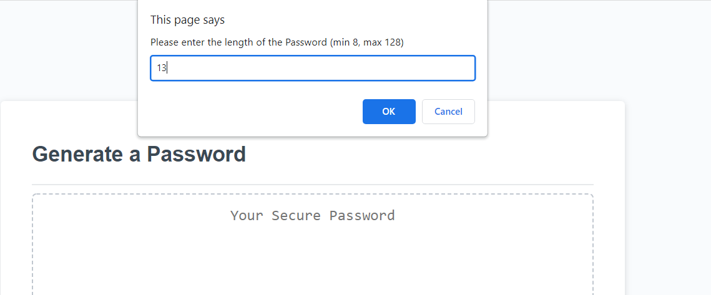
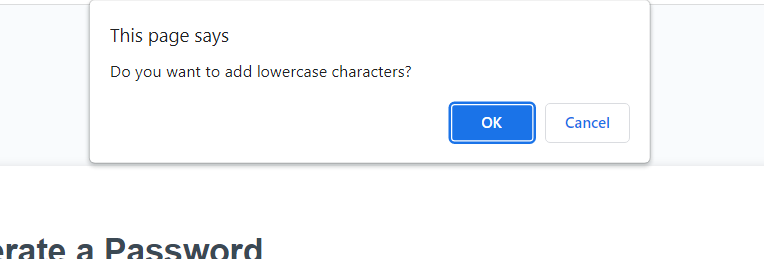
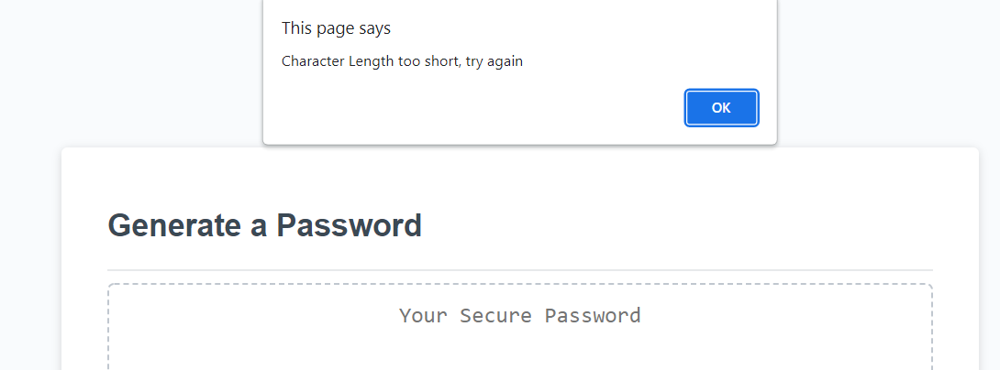

# Homework 3 - Password Generator!

### This is Mikhail Sookwah's project of generating a password

The program includes:

* The Option to choose the length between 8 to 125

* Allows you to choose among 4 types of characters (you need to choose at least one)

    * This program uses an array to keep track of the options, then uses a case swtch to randomize the character allocation.

[Link to the web-page itself](https://mikhail25.github.io/Hw3-PasswordGenerator/)